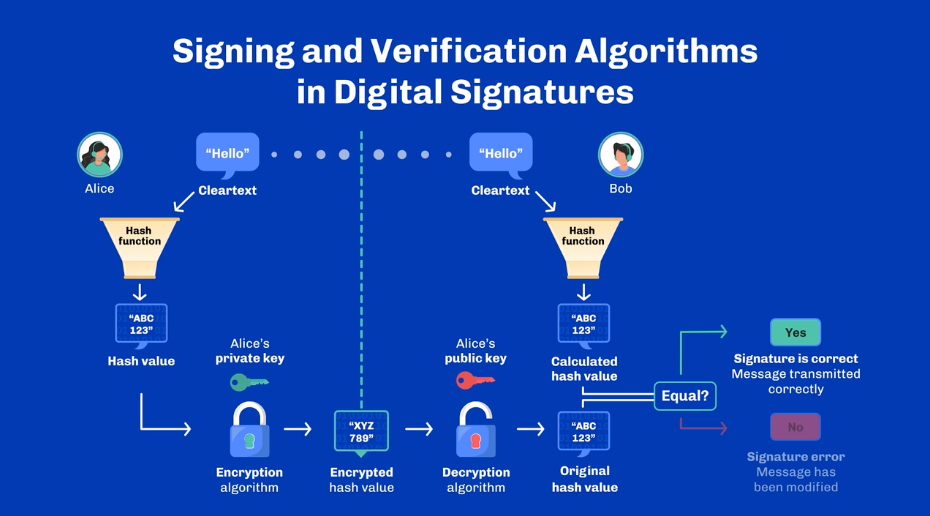

# Digital signatures

- Signing algorithm - uses the sender's private key and the original message
- Verifying algorithm - uses the sender's public key and the original mesage

> Unlike encryption, digital signatures does not hide the message

## The process

Only Alice **owner of the private key** can use the singing algorithm but anyone can verify the message using Alice's public key.

## DS Algoritms

Popular algoritms are:

### RSA

Relies on the assumption that factoting two large prime numbers is difficult

_[Reference ↗](https://crypto.stanford.edu/pbc/notes/crypto/factoring.html)_

### DSA

developed in 1991 - relies on the ssumption that the discrete log problem is hard to solve

**Discrete log problem**

When looking to `x^y = z` and if you have the values `x` and `z` is hard to find `y` given `y` is a large enough number

> Bitcoin uses ECDSA which is a modification of the DSA providing the same security of RSA but with smaller key sizes and faster operations

> In 2022 Bitcoin started using Schnorr algorithms to improve its scalability, efficiancy and privacy

### Edwards-curve Digital Signature Algorithm (EdDSA)

Uses a variant of Schnorr signagute based on twissted Edwards curves.
Harold Edwares proposed Edwards curves as a mathematical concept in 2007

**EdDSA is faster** than existing DS schemes without compromising security

EdDSA adapted Curve25519 which provide faster variable-base scalar multiplecation than Edwards 25519 elliptic curves

> Cardano uses Ed25519

**Ed25519**

- Fast signing and verification
- High level of security
- Small signatures
- Small keys

## Wallets

**Wallets does not store** the tokens but stores the secret credentials needed to move token around the ledger

> A wallet can be seen as an interface around the management of a single private key

**Types of wallets**

- Custodial: Credentials and tokens are in the possession of the custodian and uses a centralized authentication system. Therefore the custodian can restrict access to the users
- Non-Custodial: Users have full control of ther keys and tokens (private/public keys)

**Storing the private key**

- Hot storage: an application is connected to the blockchain network (Desktop, browser or web wallets)
- Cold storage: stores the private key offline adding an extra layer of security (USD, paper or steel wallets)
