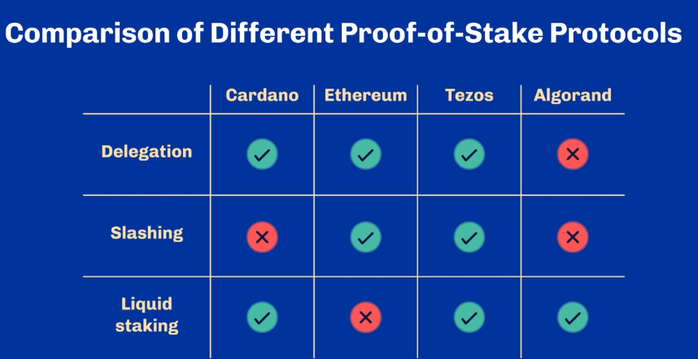

# Proof of stake and Proof of work

Proof of work and proof of stake are the two most popular proof-based consensus algorithms

Block producers are given a chance to produce a block proportionally to the resource they contribute to the network

- In proof of work, the resource is quantified in **hashing power**
- In proof of skate, it is the underlying native currency of the network, also known as stake

## Proof of work

Block producers are called miners in proof of work

Mining is the process of repeatedly calculating hash digest values for many different nonce values until a suitable hash if found

The number of leading zeros are decided by the protocol also called chain difficulty

When more hashing power is added to the network the protocol must increase the difficulty because **it must take time!**

[▶️ Proof of work](https://www.youtube.com/watch?v=3EUAcxhuoU4)

> Bitcoin uses proof of work but Proof of work is older than Bitcoin

Bitcoin consensus has more elements added to their proof of work:

- Longest chain rule
- Adjustable difficulty

### Drawbacks

- Energy consumption
- Dedicated hardware
- Not sustainable for many

> Using energy and computer power to found meaningless hashes

Ofelimos tries to solve optimization problems by offering proof-of-useful-work

## Proof of stake - Virtual Resources

Block producers can produce proportionally for how much stakes they have added to the network. It is called stake because means "skin-in-the game"

### Follow the Satoshi

> Choosing a leader (primary block) to start consensus

A algorithm that randomly choices the small unit of a token finds its owner electing they to be the next block producer. That way chances of getting picked is correlated to the amount of stake that user has.

Later was used by Bitcoin it self improved this algorithm and called Bitcoin ordinals

- [] How Bitcoin order and rank Satoshis to create the rarity concept and using it to create NFT's?

**How to pick a random Satoshi?**

_Randomness is a challenging topic in computer science and mathematics_

So **scientists** prefer to work with the notion of **pseudo-randomness**

**A value is pseudo-random if it appears to be statistically random**

Meaning: finding a pattern that could explain how values are produced is computationally infeasible

### Difference between PoW and PoS Randomness

- PoS uses Verifiable Random Functions (VRF) to calculate a random value to choose the block producer
- PoS uses multi-party computation using a fraction of the computation required by PoW

- [] I didn't quite understand how VRF works to create pseudo-randomness in a PoS protocol

### Drawbacks of PoS

- **The rich gets richer over time**: since the right to produce blocks is proportional to the stake owned so they are increasingly more likely to produce future block
- **Using stake as a consensus resource may contradict a currency's very purpose:** selling stakes makes users to lose influence and ability to participate in consensus so theoretically this could freeze the entire network harming one of the key property of distributed systems: liveness
- **Bootstrapping of PoS network:** usually is the result of a Initial Coin Offering (ICO) before the start of the network leading to a few actors controlling a large portion of the network

> Cardano only offered a portion of the total tokens in the ICO and after 2020 is continuously putting more into circulation

### PoS vs PoS

Not all PoS are the same. Each protocol chooses what mechanisms they want to use to cope with the drawbacks.

**Delegation**

The ability of stakeholders to delegate their stake. Delegation can allow many small actors to unite and stand against more prominent actors

_Delegators_ are rewarded as are indirect involved in consensus

> Cardano introduces Delegation

- [] Didn't understand how delegation works in practice

**Slashing**

The ability to sanction adversarial behaviors in the system

Is a way to _Delegators_ to ensure their chosen _Delegates_ does their job correctly

**Liquid vs Frozen Stake**

This creates a differentiation between the stake used to participate consensus and the network currency

> Cardano lets users exchange stake even if is being used to participate consensus

> How can you follow the Satoshi if the Satoshi is always changing its owner? Cardano uses snapshots divided by time chunks (whatever that means)

- [] How stake are used during consensus?
- [] What is Cardano snapshots?
